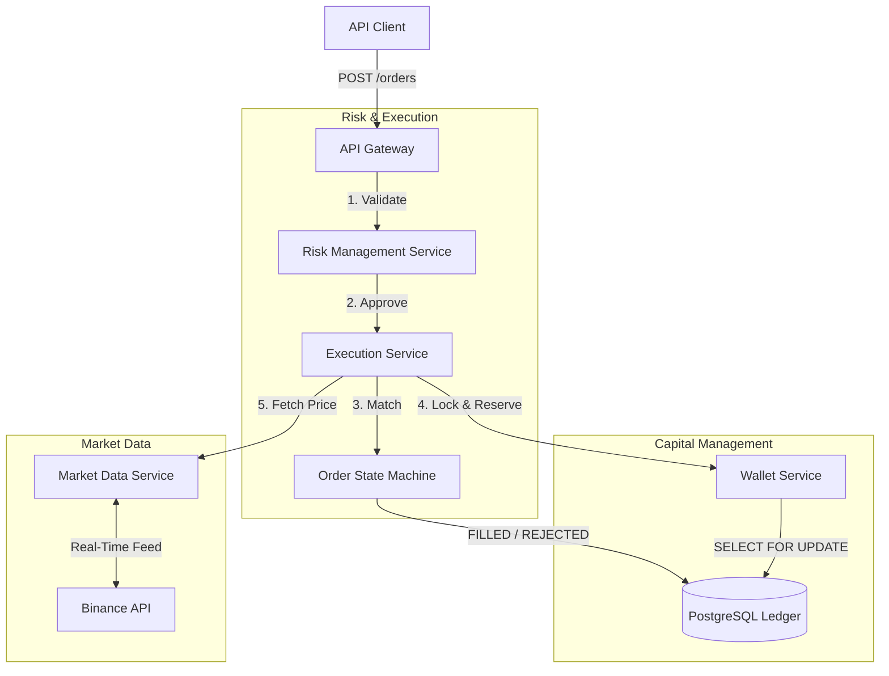

# APEX: Algorithmic Trading Engine

**APEX** is an institutional-grade financial operating system designed for low-latency algorithmic trading. It simulates a high-frequency trading environment with real-time market data ingestion, strict ACID-compliant capital management, and a deterministic execution engine.

## System Architecture

APEX adopts a **Modular Monolithic** architecture to minimize network latency—a critical factor in high-frequency trading. The system is divided into four distinct planes:

1.  **Market Data Plane**: Ingests real-time price feeds via the Binance Public API.
2.  **Capital Plane**: Manages user funds using an immutable ledger and pessimistic locking.
3.  **Execution Plane**: Orchestrates order validation, risk checks, and state transitions.
4.  **Intelligence Plane**: Hosts pluggable trading strategies and backtesting engines.




## Key Features

### 1. Capital Integrity & Concurrency Control

* **Immutable Ledger**: Replaced simple balance updates with a transactional ledger system. All financial movements (deposits, withdrawals, trades) are recorded as immutable entries.
* **Pessimistic Locking**: Utilizes `SELECT ... FOR UPDATE` (Pessimistic Write Lock) on wallet records during transaction processing. This ensures strict serialization of concurrent requests, preventing race conditions and double-spending vulnerabilities.

### 2. Real-Time Market Data Engine

* **Live Ingestion**: Integrates directly with the **Binance Public API** to fetch real-time pricing for crypto assets (e.g., BTC/USDT).
* **Fault Tolerance**: Implements resilience patterns to handle API timeouts and rate limits without disrupting the core application state.
* **Tick Persistence**: Captures and stores high-frequency market ticks (`MarketTick`) to PostgreSQL for historical analysis and backtesting.

### 3. Deterministic Order Execution

* **State Machine**: Orders follow a strict, uni-directional lifecycle: `CREATED` → `VALIDATED` → `FILLED` (or `REJECTED`).
* **Idempotency**: API endpoints enforce idempotency via unique keys to prevent duplicate order execution during network retries.
* **Audit Logging**: Every state transition is recorded in an audit table with precise timestamps for compliance and debugging.

### 4. Pluggable Strategy Architecture

* **Strategy Pattern**: Implements the Open/Closed Principle. New trading strategies can be added by implementing the `TradingStrategy` interface without modifying the core engine.
* **Auto-Discovery**: A `StrategyRegistry` automatically detects and loads all available strategy components at runtime using Spring's Application Context.
* **Backtesting Engine**: A dedicated service replays historical `MarketTick` data against active strategies to simulate performance and calculate P&L.

### 5. Risk Management Layer

* **Pre-Trade Validation**: A centralized `RiskGuard` intercepts all orders before execution.
* **Fat Finger Protection**: Automatically rejects orders exceeding defined notional value thresholds (e.g., $5,000).
* **Wash Trade Prevention**: Blocks orders that would result in self-matching.


## Technology Stack

| Component | Technology | Description |
|  |  |  |
| **Language** | Java 17 | LTS version chosen for stability and performance. |
| **Framework** | Spring Boot 3.2.2 | Core application framework. |
| **Database** | PostgreSQL 16 | Relational persistence layer ensuring ACID compliance. |
| **Containerization** | Docker & Compose | Orchestration for the application and database. |
| **Build Tool** | Maven | Dependency management and build automation. |


## Getting Started

### Prerequisites

* Docker Desktop (or Docker Engine + Compose)
* Java 17 SDK (Optional, for local development)

### Installation

1. **Clone the Repository**
```bash
git clone [https://github.com/debayan91/Apex.git](https://github.com/debayan91/Apex.git)
cd Apex

```


2. **Launch Infrastructure**
Start the PostgreSQL database and the application container using Docker Compose.
```bash
docker-compose up -d --build

```


3. **Access the Application**
The API will be available at `http://localhost:8080`.


## API Reference

### Order Management

**Place New Order**
Executes a trade with idempotency and risk validation.
`POST /api/orders`

```json
{
  "userId": 1,
  "symbol": "BTCUSDT",
  "side": "BUY",
  "quantity": 0.5
}

```

*Headers required:* `Idempotency-Key: <unique-uuid>`

### Strategy Intelligence

**Get Strategy Signal**
Runs a specific strategy against the latest market data.
`POST /api/strategies/{strategyName}/signal`

**Run Backtest**
Simulates strategy performance over a historical period.
`POST /api/strategies/backtest`

```json
{
  "strategyName": "SMA",
  "start": "2024-01-01T00:00:00",
  "end": "2024-01-02T00:00:00"
}

```


## Engineering Design Decisions

### Monolithic Architecture vs. Microservices

Given the latency-sensitive nature of high-frequency trading simulations, a monolithic architecture was chosen to eliminate network hops between the Execution, Risk, and Capital services. This design maximizes throughput and simplifies transactional consistency.

### Data Consistency

Financial accuracy is prioritized over eventual consistency. The system employs **Pessimistic Locking** rather than Optimistic Locking to handle high-concurrency scenarios, ensuring that user balances are never overdrawn even under heavy load.


## License

This project is licensed under the MIT License.

